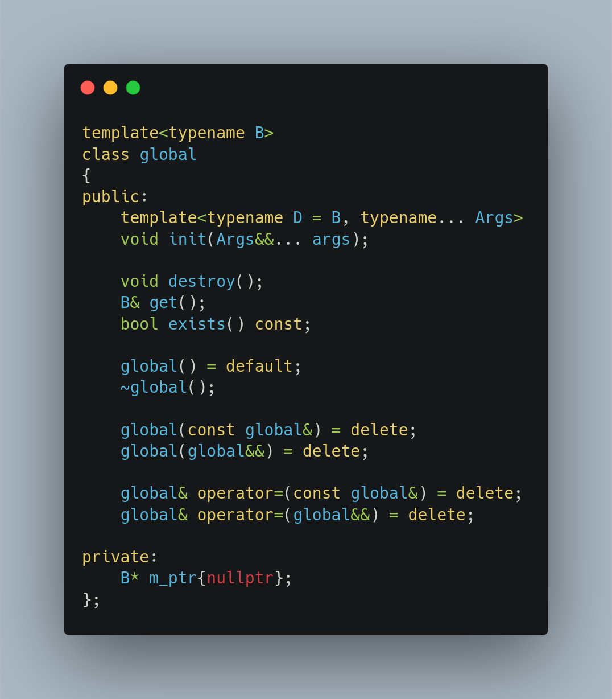
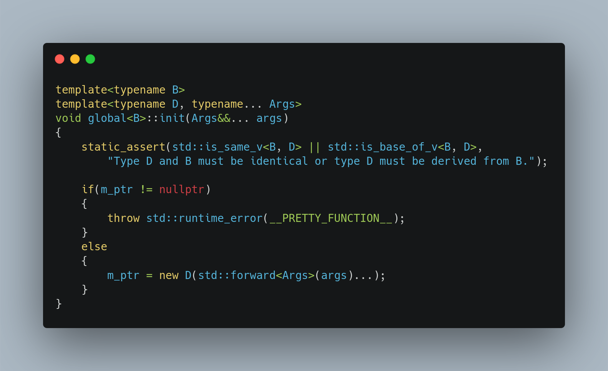
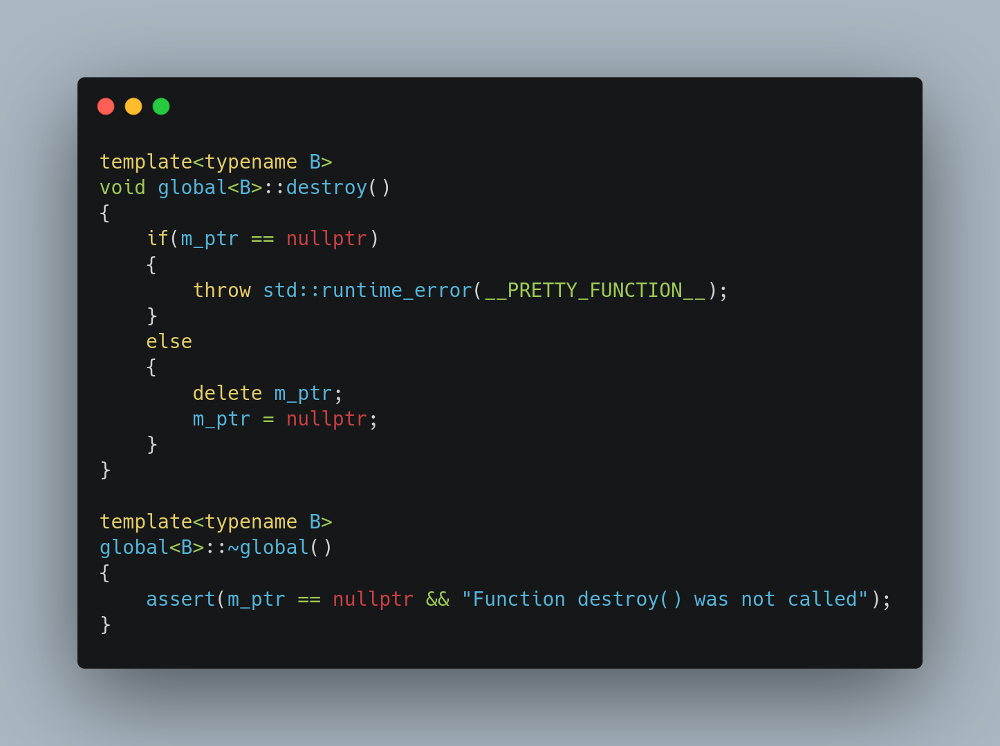

# Short articles describing my achivements

## Class definition

For class of name `Matrix`, the global variable must be used as follows

To function `global::init` the derived class can be passes as well

The global object must be destroyed exactly one time

In order to use the object, call function `global::get` defined as follows

The existence of the object can be check by function `global::exists`

