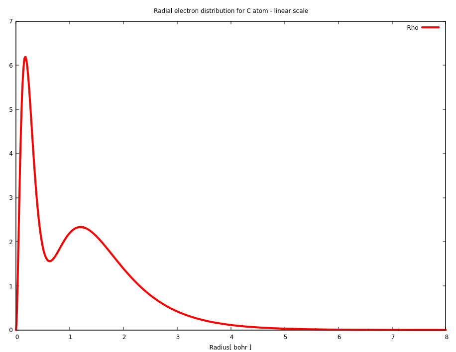
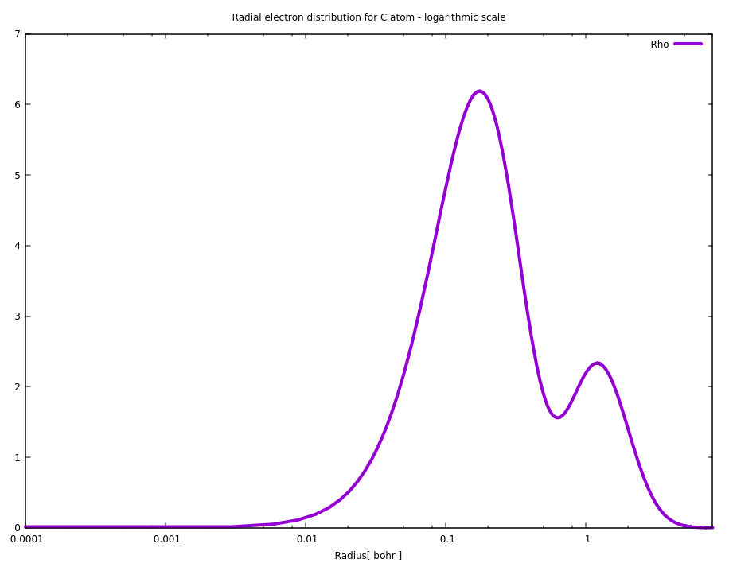
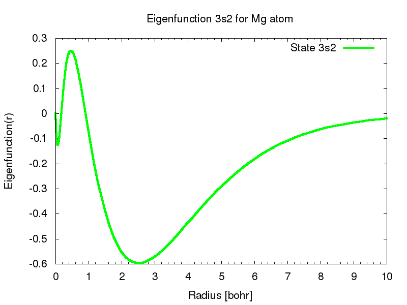
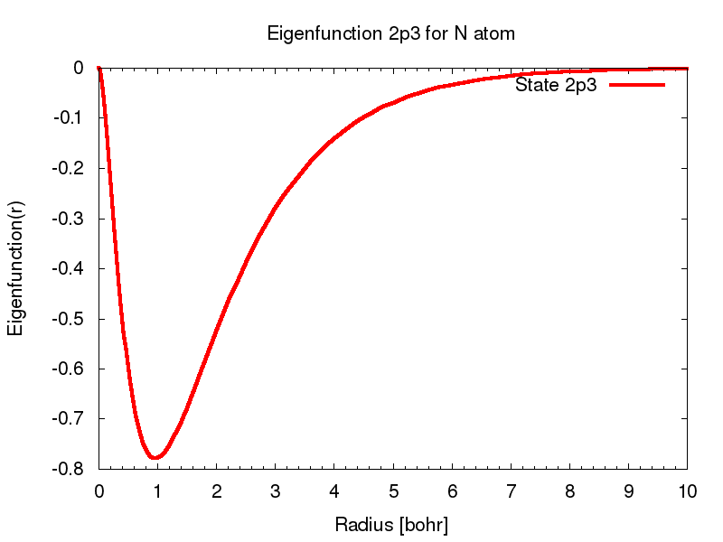

# Kohn-Sham equation for the neutral atom

## See my GitHub repository [kohn-sham-atom](https://github.com/romz-pl/kohn-sham-atom)

I wrote the C++ program called **RAtom** solving nonlinear Kohn-Sham equation for the neutral atom. The program **RAtom** is available as C++ source code, see GitHub repository [kohn-sham-atom](https://github.com/romz-pl/kohn-sham-atom). The adaptive algorithm based on finite element method (FEM) is implemented.
### The implemented algorithm is described in the following papers:

1. Z. Romanowski, Adaptive solver of a Kohn-Sham equation for an atom, Modelling Simul. Mater. Sci. Eng. vol. 17, 045001 (2009), [abstract](https://iopscience.iop.org/article/10.1088/0965-0393/17/4/045001/meta)

2. Z. Romanowski: Application of h-adaptive, high order finite element method to solve radial Schrödinger equation, Molecular Physics, vol. 107, pp. 1339-1348 (2009), [abstract](https://www.tandfonline.com/doi/abs/10.1080/00268970902873554)

3. Z. Romanowski, A B-spline finite element solution of Kohn Sham equation for an atom, Modelling and Simulation in Materials Science and Engineering, vol. 16, p. 015003 (2008), [abstract](http://iopscience.iop.org/article/10.1088/0965-0393/16/1/015003/meta)

4. Z. Romanowski, Numerical Solution of Kohn–Sham Equation for Atom, Acta Physica Polonica B, vol. 38, p. 3263 (2007), [full paper](http://www.actaphys.uj.edu.pl/fulltext?series=Reg&vol=38&page=3263)

### The summary of the implemented algorithm

1. RAtom is the solver for non-linear Kohn-Sham equation, which is non-linear differential, second order, eigenvalue problem.

2. This class is the wrapper for all required resources.

3. RAtom solves linear Kohn-Sham equation by Finite Element Method (FEM) with Lobatto polynomials as basis functions.

4. RAtom solves the non-linear Kohn-Sham equation iteratively by so called Self Consistent Field (SCF) procedure.

5. In order to calculate interaction potential in linear Kohn-Sham equation, Poisson equation is solved.

6. The Poisson equation is the differential, second order, equation. RAtom solves Poisson equation by Finite Element Method (FEM) with Lobatto polynomials as the basis functions.

7. For Poisson equation and Kohn-Sham equation, the electron density is needed. The electron density is represented (approximated), as the linear combination of Lobatto polynomials.

8. The distinguished feature of RAtom is the implemented h-adaptive procedure. The following problems are solved adaptively: a) Linear Kohn-Sham equation b) Poisson equation c) Approximation of electron density

9. The disctretization of linear Kohn-Sham equation leads to the generalized eigenvalue problem, which is solved by procedures from LAPACK libraries.

10. High order Gauss quadratures are applied in order to obtain the total energy of atom with absolute accuracy of 1E-6 hartree.

11. The program RAtom is implemented in C++, it runs as a single thread.

### Exemplary solutions

1. Radial electron distribution for C atom - linear scale

2. Radial electron distribution for C atom - logarithmic scale

3. The eigenfunction 3s2 for Mg atom

4. The eigenfunction 2p3 for N atom

