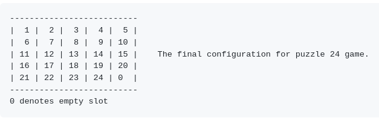
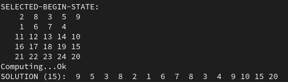
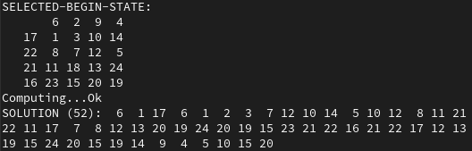

# How to solve sliding puzzle game

### See my GitHub repository [sliding-puzzle-game](https://github.com/romz-pl/sliding-puzzle-game)

I have implemented program solving [sliding puzzle](https://en.wikipedia.org/wiki/Sliding_puzzle) for the board of size 5x5, i.e. puzzle 24 game. The source code in C++ is available on my github repository [sliding-puzzle-game](https://github.com/romz-pl/sliding-puzzle-game).

The goal of the game is to slide the tiles on the board to obtain the final configuration. Each tile has assigned the unique integer number form 1 to 24. The empty slot is represented and as the tile labeled with number 0. The final configuration is presented below:

The A* algorithm has been implemented for solving the puzzle 24 game. In order to apply the A* algorithm, the graph and the distance between graph's nodes must be defined. In my approach the node of the graph is defined as a two-dimensional squared array `5 x 5`. Each element of this array holds unique integer `x` in the range `0 <= x < 25`. Each graph's node can have 2 or 3 or 4 out-coming edges which are the results of possible moves on the game boards.

The program is equipped with five exemplary games with various difficulty levels. The first example is easy and the solution consists of 15 moves as depicted on the figure below:

The most complex example provided with the code has the solution consisting of 52 moves as shown below:

 

Further examples are easy to add.

The presented approach can be applied to solve sliding puzzle game of any size

Further information about puzzle 24 game can be found on [web page](https://web.archive.org/web/20160121153245/http://cubezzz.dyndns.org/drupal/?q=node/view/241). 
